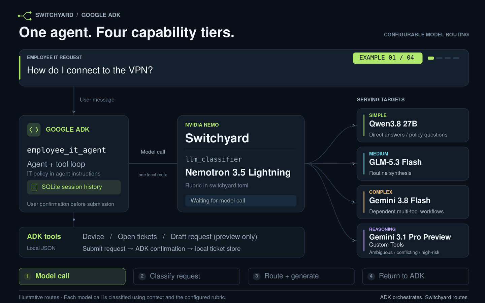

# Switchyard ADK Routing Assistant

[](https://github.com/Paul-Roeseler/switchyard-adk-routing-assistant/actions/workflows/ci.yml)
[](https://www.python.org/)
[](LICENSE)



A minimal [Google ADK](https://adk.dev/) assistant that uses [NVIDIA NeMo Switchyard](https://github.com/NVIDIA-NeMo/Switchyard) to route employee IT requests across four capability tiers and configurable inference endpoints.

## Architecture

```text
ADK Web + SQLite session history
              |
              v
     employee_it_agent
        |           |
        |           `-- model calls --> NeMo Switchyard llm_classifier
        |                                |-- classifier -> Nemotron 3.5 Lightning
        |                                |-- simple -----> Qwen3.8 27B
        |                                |-- medium -----> GLM-5.3 Flash
        |                                |-- complex ----> Gemini 3.8 Flash
        |                                `-- reasoning --> Gemini 3.1 Pro Custom Tools
        |
        +-- search_it_kb --------------------------> Vertex AI + local index
        +-- get_my_device -------------------------> local demo JSON
        +-- get_my_open_tickets -------------------> local demo JSON
        `-- draft_it_request ----------------------> preview only
```

Google ADK owns the agent, tool loop, and conversation history. Switchyard owns
request classification and outbound model selection. The agent always calls
the same local route, so changing providers does not change the agent or its
tools.

## Setup

Requirements: Python 3.12 or 3.13, [`uv`](https://docs.astral.sh/uv/),
Rust/Cargo 1.96.1 or newer, and credentials for the configured inference
endpoints.

### 1. Configure Switchyard

Edit [`switchyard.toml`](switchyard.toml) to configure the four serving targets:

| Target | Model | Purpose |
| --- | --- | --- |
| `simple` | Qwen3.8 27B | Direct answers and one policy lookup |
| `medium` | GLM-5.3 Flash | Routine synthesis across policy and employee data |
| `complex` | Gemini 3.8 Flash | Dependent multi-tool workflows |
| `reasoning` | Gemini 3.1 Pro Preview Custom Tools | Ambiguous, conflicting, or high-risk requests |

Nemotron 3.5 Lightning selects one of these targets from the rubric in the same
TOML file. No custom Switchyard runtime code is required.

### 2. Configure credentials

Copy the environment template:

```bash
cp .env.example .env
```

The checked-in configuration expects:

```dotenv
INFERENCE_HUB_API=your-nvidia-key
NEBIUS_API_KEY=your-nebius-key
VERTEX_ACCESS_TOKEN=your-short-lived-google-token
```

`VERTEX_ACCESS_TOKEN` authenticates both Gemini generation and Vertex
embeddings. Generate it with
`gcloud auth application-default print-access-token`. The checked-in
configuration targets project `model-routing-505414` in location `global`, so
no additional Google Cloud environment variables are required.

### 3. Install and run

```bash
make setup
make embed
make test
```

Start the two local processes in separate terminals:

```bash
make switchyard
```

```bash
make chat
```

Open `http://127.0.0.1:8000` and select `employee_it_agent`.

## Demo

Use a fresh ADK session for each simple, medium, complex, and reasoning example.
The demo uses one fictional employee, a local document index, and local
JSON-backed tools. `draft_it_request` creates a preview only and does not submit
anything.
